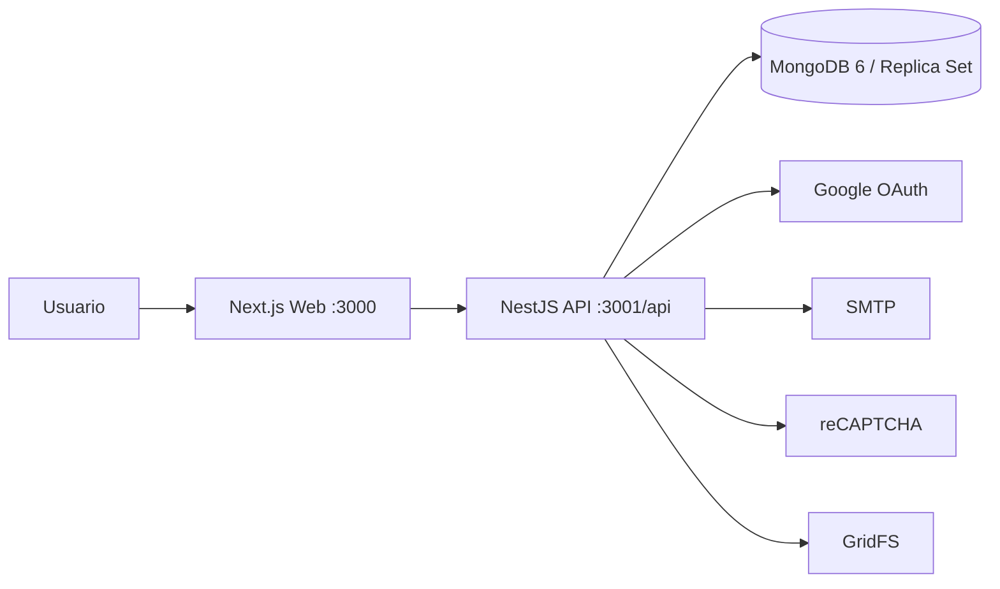

# Transferencia Técnica - Project Management Platform

## Arquitectura

### Componentes

- Frontend: `apps/web`
- Backend: `apps/api`
- Tipos compartidos: `packages/types`
- Infraestructura local: `docker-compose.dev.yml`
- Infraestructura de producción: `docker-compose.yml`

### Flujo general



## Stack exacto

- Node.js `>=20.10.0 <21`
- `pnpm@10.21.0`
- `turbo@^2.6.0`
- TypeScript `5.9.2`
- Next.js `16.0.0`
- React `19.2.0`
- NestJS `11.x`
- MongoDB `6`
- Mongoose `8.19.3`

## Desarrollo local

1. Instalar dependencias.
2. Levantar API y MongoDB con Docker.
3. Levantar web con Turbo.

Comandos:

```bash
pnpm install
docker compose -f docker-compose.dev.yml up --build
turbo dev --filter=web
```

## Seeding

- El API corre seed automático si la base está vacía.
- También existe seed manual con `GET /seed/:password`.
- Existe reparación de índices con `GET /seed/fix-matricula-index/:password`.
- El password depende de `SEED_PASSWORD`.

## CI/CD

- `verify.yml`: lint, typecheck y build en pull requests hacia `main`.
- `deploy.yml`: despliegue en push a `main`.
- El despliegue crea `.env.production` desde GitHub Secrets y levanta contenedores con Docker Compose.

## Mantenimiento

- Si el backend falla por compatibilidad de modelos o queries, revisar primero cambios en `files`, `projects`, `teams` y `activities`.
- Si algo rompe en UI de archivos, revisar `apps/web/src/components/file-list.tsx` y `apps/web/src/components/activity-card.tsx`.
- Si se toca un servicio con nuevos `InjectModel`, actualizar el `MongooseModule.forFeature` del módulo correspondiente.

## Referencias clave

- [package.json](../package.json)
- [turbo.json](../turbo.json)
- [docker-compose.dev.yml](../docker-compose.dev.yml)
- [docker-compose.yml](../docker-compose.yml)
- [API sample.env](../apps/api/sample.env)
- [Web sample.env](../apps/web/sample.env)
